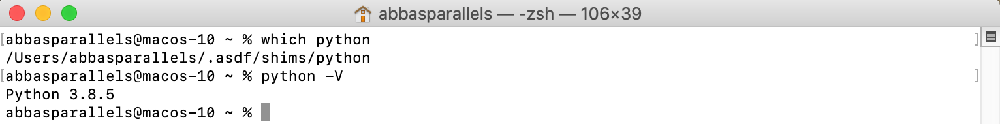
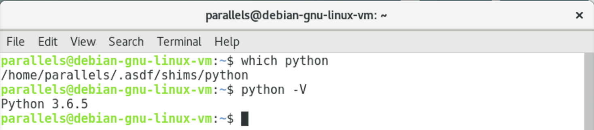
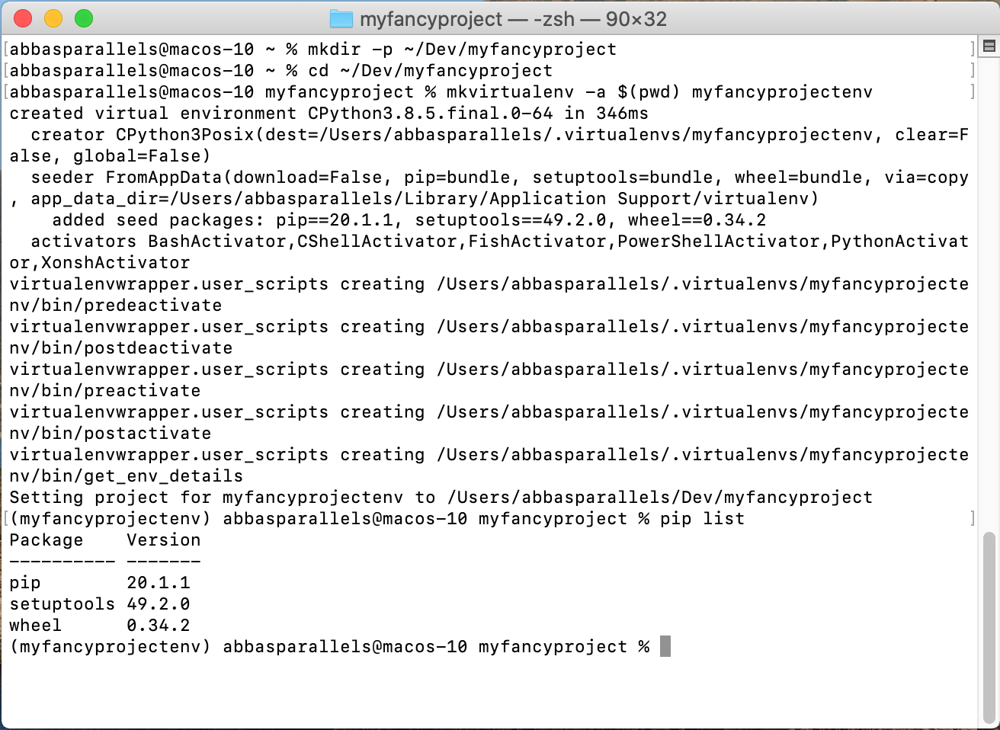
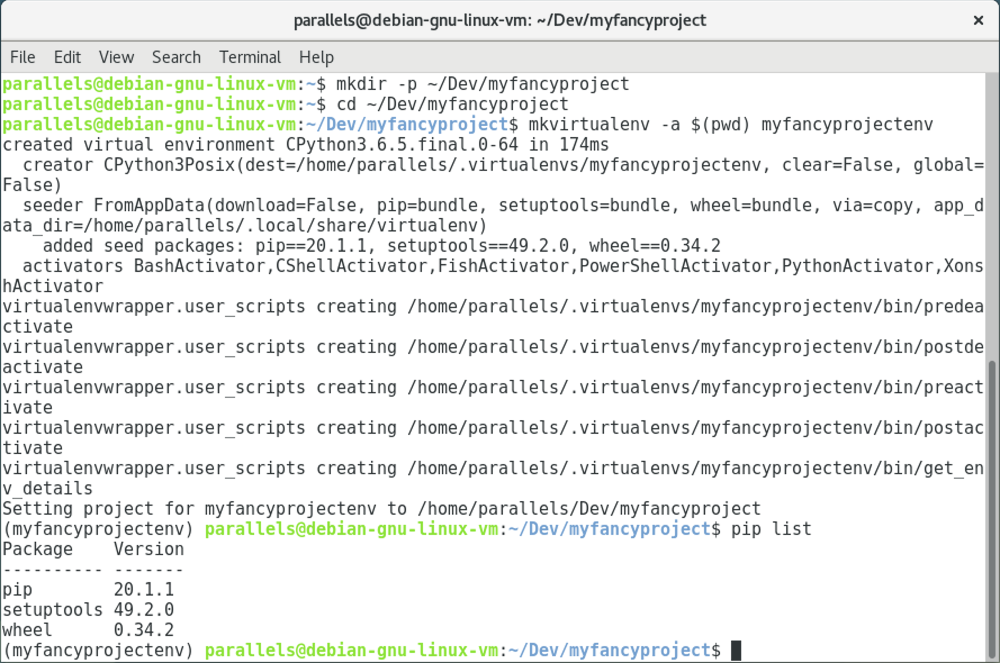
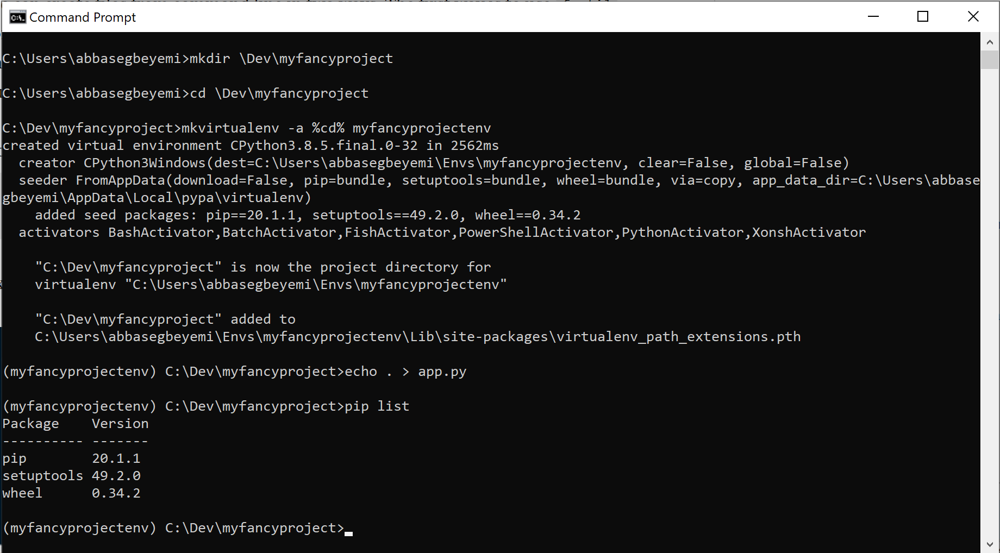

--- 
title: Setting up your computer for the best Python application development experience.
description: You might be new to this, or you might be veteran. Either way, in this blog post I share a development workflow that takes the hassle out setting up your project, and lets you get straight to buiilding your great applications every time. You will learn how to set up asdf tomanage multiple versions of python, and how to use virtualenv with virtualenvwrapper to create virtual environments.
techTags: asdf, python, windows, linux, macOS, vitualenv, virtualenvwrapper, venv
template: blogpost
date: 2020-07-23
image: main.png
tags: ["asdf", "python", "virtualenv", "100daysofcode"]
credits: [{"asset": "Cover Image", "name": "LUM3N", "url": "https://unsplash.com/photos/-RBuQ2PK_L8"}]
---

So you've done a few python tutorials and you're ready to get your hands dirty,
and start building your own projects. Well, my friend, you have come to the right
place. This is the next step in your journey to learn programming, and I can
assure you that it a step in the right direction. After this, you will have
a solid workflow for setting up your own personal projects, which is truly where the
real learning begins. 

This post assumes you have nothing installed, and
you are setting up from scratch. I personally develop on macOS and Linux
machines, but I will endavour to touch on the Windows equivalent of this process
wherever available. Enough talk, lets jump in.

### Get the Job Done - Python.

The python programming language has a somewhat weird history. There are two main
versions of Python, Python 2 and Python 3. It goes without saying that Python 2
is the OG, and you will probably still find a lot of code written in this
version. It is advised however, that if you are just starting out, you do not
bother with this version as it is no longer supported. The main differences
between the versions are in the syntax, which means that code written with
python 2 syntax do not work in python 3. However, once you get a good grasp of
Python 3, you will find that you understand Python 2 code whenever you encounter
them in the wild. I learned on Python 3 a couple of years ago now, and I can
tell you that Python 3 (on 3.8.5 at the point of this writing) is very mature.
The point of all of this talk is that this setup tutorial is for Python 3, and I
cannot say that any of this works for Python 2 - not that you should be trying
to set up Python 2 anyway.

#### Which Version? - asdf
As I said there are two main versions of Python,
Python 2, and Python 3. There are however, what is called releases of Python 3
which you can recognise by looking at the version numbers 3.X.Y. The number
corresponding to the Y in the version number is a minor release, and that
corresponding to the X is the major release. You can always check the release
notes on the main [python website](https://docs.python.org/3/) for the
differences between the versions. You might be thinking "I'll only need a single
version, or I'll just use the latest version", it is not that straightforward my
friend, as some libraries you might require may only be compatible with an
earlier version of Python, and in some cases, some functionality is only
available in a newer version of Python.

[Asdf](https://asdf-vm.com/#/) is a command line interface tool that enables you
manage multiple versions of programming languages. It works for many programming
languages, a list of which you can find
[here](https://asdf-vm.com/#/plugins-all), but I will be taking us through
setting it up for Python. Say you want to write an application that you want to
package using [PyIstaller](https://www.pyinstaller.org/), which only works
properly up to Python 3.6 (at the moment of writing), then you can easily set
the project up to use Python 3.6 with a single command in your terminal. 

Unfortunately, asdf is not available on Windows, however if you are using the
Linux Subsystem for Windows for your development, you might be able to follow
along <span className="emphasize">(I have not tested this)</span>. On Windows
you just have to download and install the python version you want to use from the [python
website.](https://www.python.org/downloads/)

##### Break the garden walls - macOS.

Developing on a Mac is a ton of fun, and
while Apple have kept the OS very closed, many very smart people have figured
out ways to make developing on a Mac almost as easy as developing on Linux (tbh
macOS is really just a very refined Linux distribution). Macs do not come with a
package manager by default unlike pretty much every linux distribution, however
we have Homebrew to the rescue. The merits of Homebrew warrant a-whole-nother
article, but for the sake of avoiding too much digression, I'll pop the command
for installing Homebrew below, and you can go to the [Homebrew
website](https://brew.sh/) to read about the elite lifestyle having a package
manager on your mac affords. 

Paste the following command in your terminal and press enter, and you should
have Homebrew installed. Restart your terminal to to activate it. 

```sh
/bin/bash -c "$(curl -fsSL https://raw.githubusercontent.com/Homebrew/install/master/install.sh)
```

You might also want to configure terminal shell completions for Homebrew, so
check [this
page](https://docs.brew.sh/Shell-Completion#configuring-completions-in-bash) for
instructions on doing that. 

<div className="side-note">

Side note: You can install Python and other languages using homebrew, but asdf
helps you manage, and easily activate versions.

</div>

With Homebrew installed, you want to make sure you have the required
dependencies for asdf installed namely curl and git. Though on macOS curl
usually comes pre-installed. So it is 

```sh
brew install coreutils curl git
```

and then all that is left is to run 

```sh
brew install asdf
```

congratulations you have installed asdf. 

Now for it to work you need to have your terminal run the asdf activation script
every time you open a new terminal window. If you are using macOS 10.15 Catalina
and after, the default shell is zsh. Before Catalina, the default is bash. In
either case you want to add the following command to your .bashrc or .zshrc
file. Commands in this file are ran whenever you open a new terminal window.

To open your zshrc file, enter the following in the terminal

```sh
nano ~/.zshrc
```

OR

```sh
nano ~/.bashrc
```
to open your bashrc file.

Scroll to the bottom of the file, and paste the following

```sh
. $(brew --prefix asdf)/asdf.sh
```

What this does is that it enables you to use the programming language managed by
asdf by default, and sets up asdf.


##### Look mum I'm a hacker - Linux

If you're developing on Linux, you (should) already know what your package
manager is, and how to use it. Check the [installation instructions
page](https://asdf-vm.com/#/core-manage-asdf-vm) for the command which
corresponds to the package manager on your distribution, but for 'aptitude'
(Debian based distributions) you want to run the following command to install
the dependencies required for asdf (git and curl).

```sh
sudo apt install curl git
```

Installing asdf on Linux is simply cloning from the git repository to your home
folder. The command to clone from the latest branch (at the time of writing) is
```sh
git clone https://github.com/asdf-vm/asdf.git ~/.asdf --branch v0.7.8
```
You then need to add the following command to your .bashrc/.zshrc file depending
on your shell. This runs the asdf activation script every time you open a new
terminal. If you are using a zsh framework plugin like [oh my zsh!](https://github.com/ohmyzsh/ohmyzsh)
(which is also great by the way) then you have to configure using that plug in. Usually your
.bashrc or .zshrc file is in the home folder. To open your zshrc file, enter in the terminal,

```sh
nano ~/.zshrc
```


OR

```sh
nano ~/.bashrc
```

to open your bashrc file.

Scroll to the end of the file, and paste the following command.

```sh
. $HOME/.asdf/asdf.sh
```

CTRL + X to save, leave the name as it is, and press enter.

You have now successfully set up asdf.

##### Is it plugged in yet? - The Python Plugin

As I have mentioned before asdf is a
version manager for your programming languages (among other things). Each
language you install is a plugin. To install python as a plugin (on Linux and
macOS) the command is 

```bash
asdf plugin add python
```

When you have the python plugin installed, you can install any version you want
(say python 3.5.6), by typing the command 

```bash
asdf install python 3.6.5
```

to install the latest stable version of python, the command is 

```bash
asdf install python latest
```

and to install the latest minor release of a major release (say the latest
python 3.8 release) the command is 

```bash
asdf install python latest:3.8
```

Now that you have a version (or two) of python installed, you can easily
activate the version you want to use on a global level using the command
(assuming Python 3.8.5 is a version you have installed),

```bash
asdf global python 3.8.5
```

And that's it. Type in the terminal 

```bash
which python
```

to confirm the active version of python. The images below show how it looks on
my computer.





As you can see I'm running fresh installs of macOS Catalina, and Debian Linux to
ensure that the steps I'm describing are not influenced by the configurations on
my personal computer. I have installed Python 3.6.5 using the bash shell on the
linux machine, and Python 3.8.5(the latest) using the zsh shell on macOS.

<div className="side-note">

Side note: If you are on Linux, you may encounter the error:

```console
zipimport.ZipImportError: can't decompress data; zlib not available
```
This means that the library `zlib`, which is required for the python installation
is not available on your machine. Run the following command, which includes
zlib, and a bunch of other useful libraries to get past that error. 

```sh
sudo apt-get install build-essential libsqlite3-dev sqlite3 bzip2 libbz2-dev zlib1g-dev libssl-dev openssl libgdbm-dev liblzma-dev libreadline-dev libncursesw5-dev libffi-dev uuid-dev
```

</div>

#### A conducive environment - Virtualenv and Virtualenwrapper

Yes, so we have python on our computer. Not only that, we can install and
activate any version of python by typing a few commands. Time to get started on
that fancy new application? Well not yet. You see, while you are very free to get
started, there are some habits that are best cultivated so that you develop an
efficient workflow. After all the whole point of this post is to show you how to
get that peak development experience. 

Pretty much every python command you call, is part of a library of commands that
has been written by others. Basically in programming, you are almost always
standing on the shoulder of giants, and when you 'git good', you can decide to
become a giant yourself. There are the core libraries, already included with
every python installation, and there are external libraries you install as
needed, to expand your python installation in order to do even cooler stuff.
Examples of core libraries are `pathlib, sys, math`, which do not require
any installs to be imported into your code. Some popular external
libraries are `numpy, matplotlib, pandas`, which need to have been installed
to your python version. External libraries are usually installed using
```bash
pip install amazingLibrary
```

As you work on multiple projects, you will find yourself installing a lot of
external libraries, and some of them do not play well with each other. In some
cases you want an older version of a library, or a newer version, or even a
different version. However, if you continue to pip install all these libraries
into your base python version, you may quickly run into issues. A different
scenerio is that you may be working with someone else, or even be working on
different machines, and you may want to configure the development environment
the exact same way for the project you are working on. Installing unrelated
libraries may end up messing things up on the other machine, and it will be
difficult to pin point the exact problem. My point is, it is very good practice
to set up virtual environments for every project you work on. 

Virtualenv is that external python library that helps you create virtual
environments. There is a core library called venv included with pyton versions
above 3.3, but I recommend virtualenv. FYI You can really only use virtualenv
with python versions 3.4 and above. What it does is that it copies the base
version of python to its own directory, and installs any external libraries to
the same directory so they only work with that isolated copy of python. It also
includes all the core tools such as pip, and setuptools, so that that virtual
environment works just as your base python installation would work. When you are
done with it, you can simply delete that virtual environment, and it will delete
any libraries you installed with it. For your next project, you do the exact
same thing, and libraries aren't interfering with each other. Super neat.
Install virtualenv to your actuve python version using pip

```bash
pip install virtualenv
```

Virtualenvwrapper is and extension to virtual env, which supercharges it and
makes it more easier to use. It organises all your virtual environments in one
place, makes it easier to associate projects with virtual environments, and it
also makes it easier to create, and delete virtual environments. [Read the
docs](https://virtualenvwrapper.readthedocs.io/en/latest/) for more info.
Install virtualenvwrapper to your current python version using pip

```bash
pip install virtualenvwrapper
```

The thing to remember when using asdf with virtual env wrapper is that you want
to have both tools installed in your whatever python version you are using to
create your virtual environment. Take for instance if you have python 3.8.5 and
Python 3.6.5 installed, you want to run the previous pip commands with each
python version activated. The reason for this is because virtualenv will create
a virtual environment based on the python version used for running the command,
so you cannot create a Python 3.8.5 virtual environment by running virtualenv
with Python 3.6.5. 

After installing virtualenv and virtualenvwrapper, paste the following at the
bottom of your bashrc or zshrc file

```bash
export WORKON_HOME=~/.virtualenvs
. $(asdf where python $(asdf current python))/bin/virtualenvwrapper.sh
```

The first line tells the shell that all your virtual environments will be
located at `~/.virtualenvs`. You can change `virtualenvs` to whatever
you want, but I'd say the name is apt. The second line tells the shell to run
the virtualenvwrapper extensions located at `<pythonversion>/bin/virtualenvwrapper.sh`,
but this way, it uses the
virtualenvwrapper script for the currently active python version.

Close and reopen your terminal window, and virtualenvwrapper should be
activated. Enter the command below to have asdf properly recognise the newly
installed tools.


```bash
asdf reshim
```

And that's pretty much it. Virtualenv and virtualenvwrapper are ready to go. The
process above is pretty much the same for macOS and Linux.

##### Outside looking in - Windows

Okay I have not forgotten about our esteemed windows users. Here I will assume
that you already have Python installed. Virtualenvwrapper has been ported to
windows, and it is called virtualenvwrapper-win. It works pretty much the same
way the Linux and macOS versions work. Run the commands 

```cmd
pip install virtualenv
pip install virtualenvwrapper-win
```

to install the tools to your python version.

<div className="side-note">

Side note: Using python on windows 10, if you have not added the location of
your python install to the system path variable, you might have to write the
commands as 

```cmd
py -m pip install virtualenv
py -m pip install virtualenvwrapper-win
```

I very much recommend however, that you add the location of your python
installation to the system path variable so you avoid stories that touch.

</div>

#### It's smooth sailing from here baby - A workflow
Now that you have asdf with
virtualenv and virtualenvwrapper installed, here's a simple workflow when you
want to create a new project. The workflow is the same on Windows, however, the
commands are slightly different. For the windows commands I am assuming your are
in your home folder on the command prompt.

Create the project folder. Below is how you do it on the command line, or just use your file explorer like
a normal person.

```bash
mkdir -p ~/Dev/myfancyproject
```

```cmd
mkdir \Dev\myfancyproject
```

You do have to change your working directory to the folder you just created. And
that command is

```bash
cd ~/Dev/myfancyproject
```

```cmd
cd \Dev\myfancyproject
```

Activate the python version you want to use for this project (Python 3.8.5 in my case).

```bash
asdf global python 3.8.5
```

Create a virtual environment for the project and associate it with the
directory where the project lives.

```bash
mkvirtualenv -a $(pwd) myfancyprojectenv
```

```cmd
mkvirtualenv -a %cd% myfancyprojectenv
```

This tells it to create a virtual environment called `myfancyprojectenv` and
associate it with the current working directory. 

Create the python file where your fancy code will be written.

```bash
touch app.py
```

```cmd
echo . app.py
```

And that's it, you are ready to open `app.py` in a text editor of your
choice and create magic. Here are some screen shots after running the workflow
commands on each operating system.







<div className="side-note">

Fun tidbit: If you type the following command from any directory in your terminal,
after creating the virtual environment this way, it will take you to the associated directory, and activate the virtual
environment. Works the same on Windows, macOS and Linux.

```sh
workon myfancyproject
```

Pretty neat if I do say so myself.

</div>

If you made it this far, I'm very impressed. Please let me know in the comments
or via social meadia or by email how you got on or if you had any
issues. I'll be happy to help. In future posts I'll be talking about developing GUI
applications using Python and Qt.


<!-- <div className="credits-bg content-bg"> -->

<!-- ###### Credits -->
<!-- - Cover Image by  [LUM3N](https://unsplash.com/photos/-RBuQ2PK_L8) -->

<!-- </div> -->


